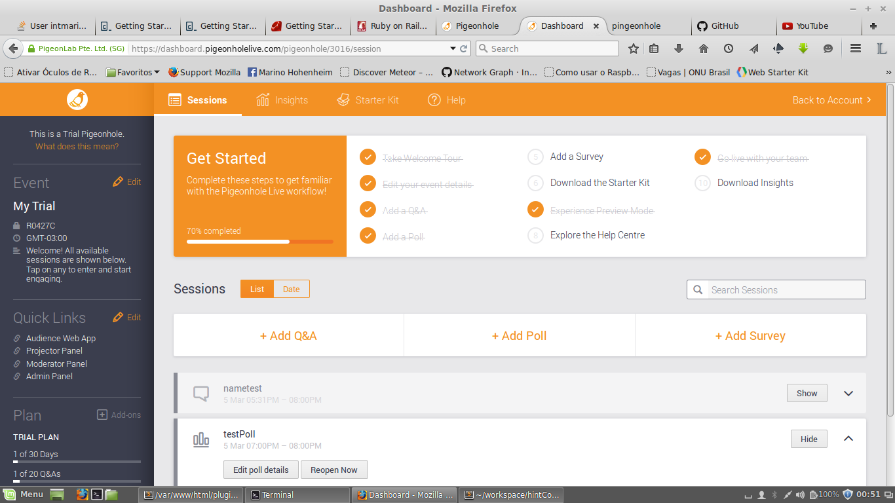
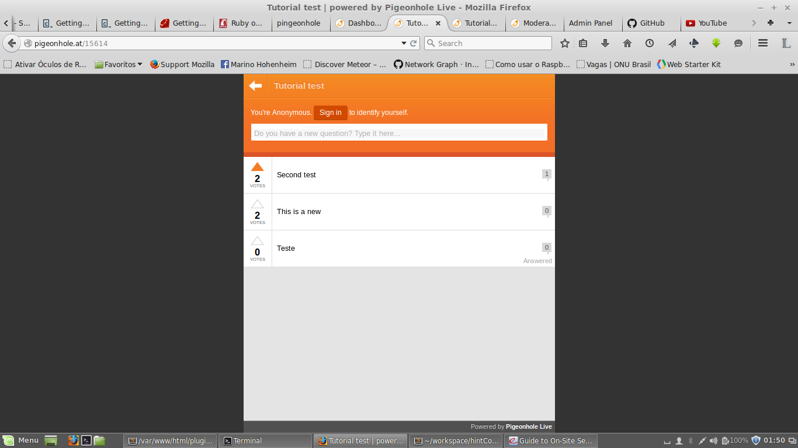
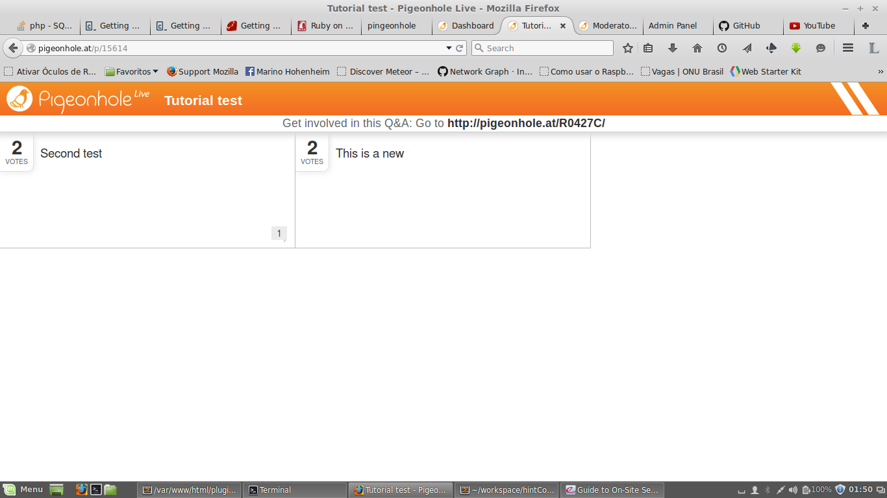
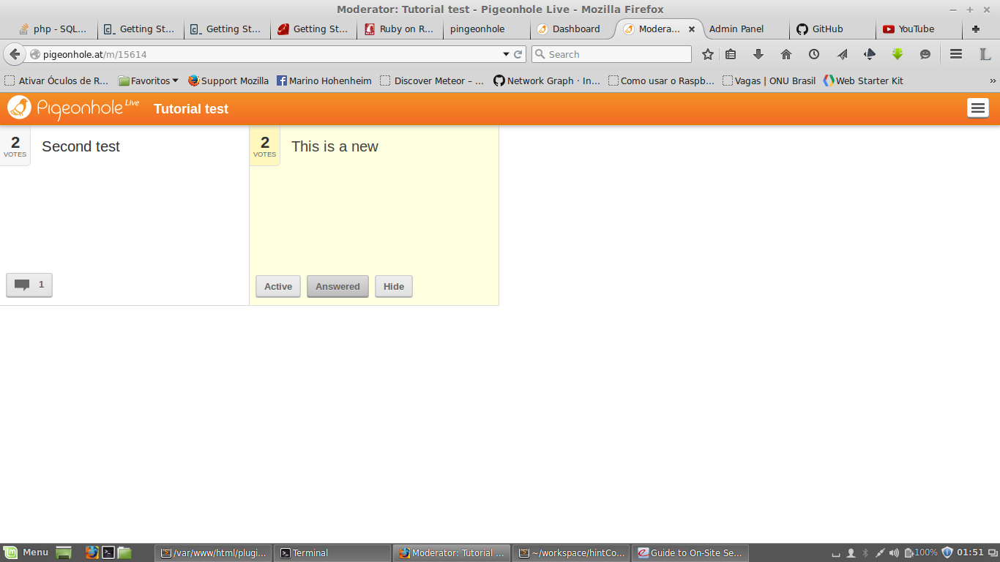
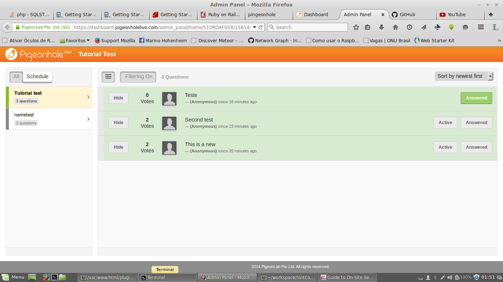

PigeonHole Passo a Passo
------------------------
###Cadastro a Uso

1. Casdastre-se no [site](https://www.pigeonholelive.com/)

    Você ganhará automaticamente um plano trial, e haverá algumas dicas no topo para configurar, e testar outras formas de configurar o seu evento. Após o login verá uma página semelhante a esta 
    No menu esquerdo temos alguns dados do seu evento, tais como:

    * código de acesso;
    * Links rápidos;
        * Página do Moderador;
        * Página do Admin;
        * Página do Público;
        * Página do Projetor;
    * Nome do Evento;
    * Informações do Plano;

2. Adicionando um Q&A
    1. Clique em `+Add Q&A`;
        * Tenha certeza de marcar a opção `Incoming questions to require approval`;
    2. Libere o link do público:
        * Através do acesso ao http://phlive.at, insere o código encontrado no menu esquerdo;
        * Ou em `Quick Links`, clica em `Audience Web App`;
    3. Ajuste a página `Projector Panel` no projetor;
        * Se precisar dar um Blank na tela tecle `B`;
    4. Entre em `Admin Panel` __NO SEU COMPUTADOR__, está tela somente você verá.
        * Para aceitar uma nova pergunta, precione `Allow`;
        * Para Bloquear: `Block`;
        * Após permitida você pode ocultar em `Hide`, e desfazer esta ação em `Show`;
        * Você pode editar em `Edit`, use apenas para correção gramatical;
        * Quando uma pergunta estiver sendo respondida, você pode destacá-la em: `Active`;
        * Após respondida é possivel removê-la em: `Answered` (está ação pode ser desfeita no mesmo botão);
    5. Modo Moderador:
        Possui quase o mesmo privilégio de um Administrador. Diferenças:
        * Somente o `Admin` pode aceitar e editar uma pergunta;
        * Sua tela e disposições dos botões é diferente;

3. Criando uma pesquisa rápida
    1. Clique em `+Add Poll`
        * No campo `Answers` você pode adicionar tipos de respostas para a platéia marcar.
    2. Ponha o `Projector Panel` na tela;

###Imagens

###Informações adicionais

Após o Evento você pode criar um `Survey`. E é possível apurá-lo através do menu superior `Insights`.

Infelizmente a conta trial so permite até 15 usuários, após isso o evento fica indisponível.
